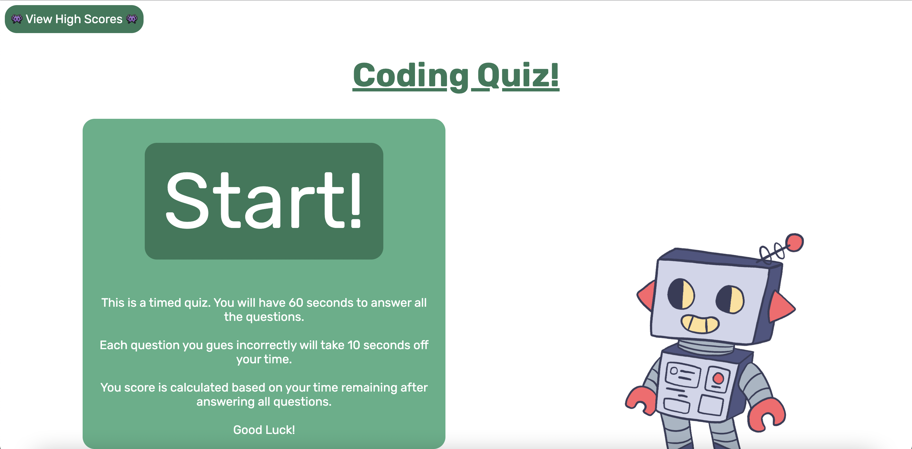

# M4-CodeQuiz

## Website screenshot 📸

## Deployed website link 🤖

-

## About this project 🐊

This project was created to meet the requirements of assignment 4. 

GIVEN I am taking a code quiz
 
WHEN I click the start button
 
THEN a timer starts and I am presented with a question
 
WHEN I answer a question
 
THEN I am presented with another question
 
WHEN I answer a question incorrectly
 
THEN time is subtracted from the clock
 
WHEN all questions are answered or the timer reaches 0
 
THEN the game is over
 
WHEN the game is over
 
THEN I can save my initials and score

## Languages 💬
HTML + CSS + JavaScript

## Usage 🐗

Use this page to take a short coding quiz! Save your scores to compare how you did on different tries. 
A robot companion will cheer you on! 

## Assets ✍️

All illustrated / animated assets created by me for my personal use only. 

